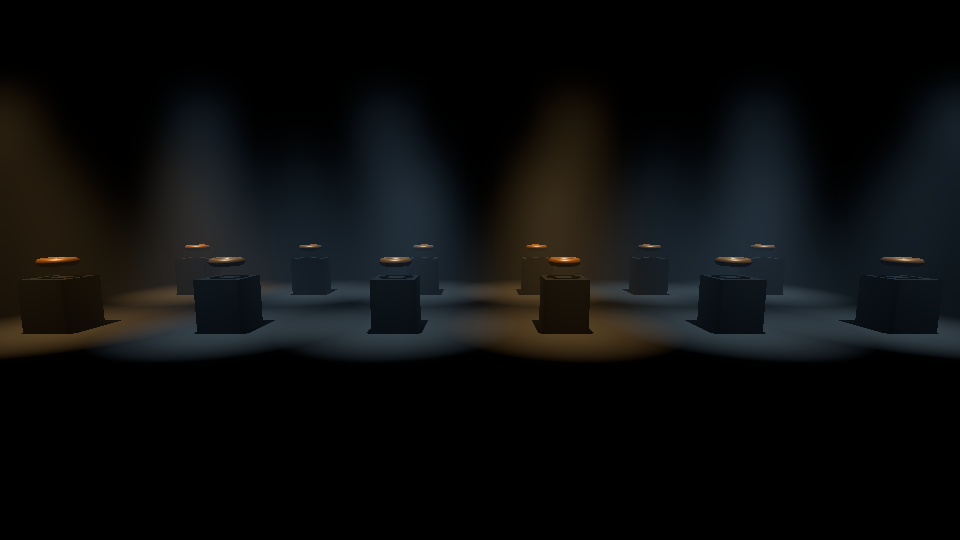

# The Museum: Architecture Decision Document

**Status: Proposed, September 2026.** This is the first document in the repository and
it is written to be reviewed before a line of engine code exists. Each ADR records a
decision and why; the engine survey in ADR-1 was checked against vendor releases in
early September 2026 (Godot 4.7.1, Bevy 0.19, godot-rust 0.5), and the version numbers
are the part that will go stale first. The structural conclusions are the durable part.

The project rules that every change is held to are in [`../CLAUDE.md`](../CLAUDE.md).
The photographs the puzzles are seeded from are in
[`reference/README.md`](reference/README.md), and the invented civilizations they are
turned into are in [`WORLD.md`](WORLD.md). Section 14 records the decisions the owner
has made; section 15 is what is still open, and it is the shortest way in.

---

## 1. The game, in one paragraph

You are locked inside an alien recreation of a human museum. The halls are the halls
of a natural history museum (a Pacific hall of carved figures and masks, a hall of
gems, a dinosaur, a table of trilobites, a Chinese altar, a diorama of a plantation),
and they are almost right. The lighting is low, the corridors are a little too long,
the labels explain the wrong things, and the artifacts have properties the originals
never had. It is played in first person. Walking up to an artifact and pressing it
moves the camera onto the object, in the manner of *The Room*, and the object becomes
the puzzle: turned, opened, arranged, listened to. The puzzles are in the tradition of
*Myst* and *Riven*: designed, self consistent, and solved by attention rather than by
inventory arithmetic. The aesthetic is liminal space: a familiar public building with
nobody in it, lit as if after hours.

## 2. Requirements (from the owner)

0. **The engine must run in the Claude Code online sandbox, headless.** Not
   negotiable, and it ranks above every other requirement. "Run" means install,
   test, build AND RENDER: in previous projects Claude rendered scenes in engine to
   troubleshoot and to prove visual work, and that is how this one is verified too.
   An engine that cannot draw a frame here is an engine whose visual claims nobody
   can check. ADR-0 is the proof that the chosen engine does.
1. **Lots of high quality lights.** A museum is hundreds of small lights: case lights,
   spots on artifacts, backlit tables, floor washes, emergency signs. That is the
   picture, and the engine has to carry it.
2. **First person**, with the camera transitioning into a focused puzzle view.
3. **Puzzles in the Myst / Riven vein**, seeded from real museum displays (section 9).
4. **Liminal, low light, uncanny.** Fog, bounce light, long sightlines, glass.
4a. **Desktop is the target**, on a decent PC. A prototype that also runs in a browser
   or on a phone is a bonus, and the interactive prototypes (ADR-8) already are that.
4b. **Keyboard and mouse, and a gamepad**, an Xbox One controller as the reference pad.
4c. **A minimal inventory:** a few artifacts carried between rooms, no crafting.
4d. **The world is invented, not reproduced.** Our own civilizations, history, writing,
   numbers, animals and ecosystem, eerily close to Earth's and not quite it (ADR-10).
5. **Materials from Material Maker; models from Blender driven by Python**; open
   source procedural tools allowed for foliage and the like, offline.
6. **Write once and reuse, SOLID, clean code.** Not negotiable.
7. **Every major UI or gameplay change is approved on an interactive JavaScript
   prototype** (a Claude artifact or an HTML page) before it is built.
8. **Static assets.** Procedural generation only when authoring is genuinely
   impractical, and then as a build step whose output is committed.
9. Open to experimental choices, including Rust, or Godot with C#.

Two things about this game shape everything below, the way "small-N and kinematic"
shaped the space game:

- **It is an authored space.** Every room is placed by hand: the walls, the cases, the
  artifacts, and above all the lights. That makes an EDITOR the most valuable tool the
  engine can offer, ahead of raw renderer features. A renderer that needs lights placed
  by typing coordinates is a renderer that will have far fewer lights.
- **It is static.** Nothing in the architecture moves. Almost all of the light is
  therefore bakeable, and baked light is both the cheapest and, for soft bounce in dark
  rooms, the best looking light there is. "Lots of high quality lights" is mostly a
  baking problem, not a runtime one, and the runtime budget goes to the few lights that
  actually change: the player's torch, a flicker, a puzzle that turns something on.

---

## ADR-0: The engine runs and renders in the sandbox, and this is the measurement

**Decision:** Godot 4.7.1 (mono) on the Forward+ renderer over Mesa's software
Vulkan driver (lavapipe) under Xvfb is the proven path, and `scripts/render-proof.sh`
is the check. It is the first thing to run in a fresh session and the last thing to
break.

**Measured on 2026-09-04, in this sandbox** (Ubuntu 24.04, no GPU, no display,
outbound HTTPS through the agent proxy):

| Step | Result |
|---|---|
| Download the editor from `downloads.godotengine.org` through the proxy | 105.9 MB, first try |
| `apt-get install mesa-vulkan-drivers vulkan-tools dotnet-sdk-8.0` | succeeded; lavapipe registered as `lvp_icd.json`, Vulkan 1.4.318, .NET SDK 8.0.130 |
| `godot --headless --import` on a C# project | succeeded |
| `dotnet build` of the C# script | 8.8 s, 0 warnings, 0 errors |
| `xvfb-run godot --rendering-driver vulkan --rendering-method forward_plus` | started: "Vulkan 1.4.318 - Forward+ - llvmpipe (LLVM 20.1.2)" |
| A 960x540 frame with 12 shadow casting spotlights, volumetric fog, SSAO, glow and AgX tone mapping | drawn and written to PNG, 680 ms per frame cold and 227 ms with the shader cache warm, in software |
| The frame itself | `reference/forward_plus_lavapipe_proof.png`: twelve lit cones in fog over shadowed pedestals, 9.1 percent of pixels above black |
| The same script on a GitHub runner | the same frame, 712 ms, so `.github/workflows/checks.yml` runs it on every pull request |



**What that establishes.** Every renderer feature ADR-3 relies on (clustered lights,
shadows, volumetric fog, the post stack) draws here, in the same code path a player's
GPU runs, only slowly. A few hundred milliseconds a frame is a screenshot every second, which is what
troubleshooting needs; it is not a frame rate, and nothing performance related is
measured on this machine (ADR-9 needs the Q3 reference GPU for that). `the-federation`
ran Godot here too, but on the Compatibility renderer over OpenGL, which has none of
the lighting features; the difference is one apt package and two flags, and the
script carries both.

**Why it decides ADR-1.** The Rust options would have to be proven the same way and
none has been: Bevy on wgpu can in principle target lavapipe, but a Bevy debug build in
this sandbox is minutes of compile before the first frame and there is no editor to
bake a lightmap in; a custom renderer would be proven only once written. Godot was
proven in twenty minutes with a script anybody can rerun. Requirement 0 is the
non-negotiable, so the engine that meets it today wins.

**The costs, so nobody rediscovers them:**

- The sandbox is ephemeral: the editor, lavapipe and the SDK are reinstalled per
  session, about two minutes. A session start hook can pay that once, and
  `scripts/install-sandbox-deps.sh` and `scripts/install-godot.sh` are idempotent so
  the hook is one line.
- Godot writes audio driver errors on a machine with no sound card. They are noise.
- The screenshot is taken from the viewport texture on frame twelve, after shaders
  compile; a frame taken earlier is black and reads as a broken renderer.
- **The guard has to be pure stdlib.** The first cut of the black frame check imported
  Pillow, which is in this sandbox only because it was installed by hand, so the first
  CI run failed with a rendered frame sitting beside it. `tools/lit_fraction.py` decodes
  the PNG itself, and is checked against Pillow rather than trusted: byte identical RGB
  on the proof frame, and the same 0.091 once its luma rounds and compares the way
  Pillow's does. A guard that needs a package the thing it guards does not need will
  fail somewhere the engine works.
- Lightmap bakes in software will be slow. Q14 asks whether bakes are committed or
  made in CI, and this is the reason to commit them.

---

## ADR-1: Engine. Godot 4 (Forward+) with C#, and the alternatives recorded honestly

**Decision:** Build on **Godot 4.7.x, Forward+ renderer, C# (.NET)** for desktop, with
the game's rules in an engine free C# library (ADR-2). **The owner has confirmed desktop
is the target (2026-09-04), so C# is settled** and the web export question closes with
it. The bonus the owner asked for, something playable in a browser or on a phone, is
served by the interactive prototypes: they are self contained HTML by rule (ADR-8) and
run on any phone, and the ADR-2 core is the same shape in JavaScript and in C#. Do not build on Bevy, do not
build a custom Rust renderer, and do not use Godot's Rust bindings for the core, for
the reasons below. Any of the three is reopenable if the answers to the section 11
questions change the brief, and the ADR-2 split is what makes reopening cheap.

### What "lots of high quality lights" actually needs

Three renderer capabilities, in the order they matter for this game:

1. **A lightmapper with bounce**, so hundreds of static lights cost nothing per frame
   and dark rooms get the soft indirect light that makes them read as rooms rather than
   as black with spots in it.
2. **Clustered (or deferred) direct lighting**, so the dynamic lights that remain are
   not capped per object at a number a museum case blows through instantly.
3. **Volumetric fog that the lights participate in**, because the liminal look is
   light in air: a spot on a mask that is also a cone of haze.

After those: screen space reflections and reflection probes for glass, ambient
occlusion, a real tone mapper, and depth of field for the inspect camera.

### The survey

| Option | Lights | Editor | Language | Runs here (req 0) | Verdict |
|---|---|---|---|---|---|
| **Godot 4.7 Forward+, C#** | Clustered forward (lights, decals and probes are binned per cluster, default cap 512 elements per cluster, thousands in a scene); GPU lightmapper with bounce (`LightmapGI`); `VoxelGI` and `SDFGI` for dynamic GI; volumetric fog with per light contribution; SSR, SSAO, SSIL, glow, DOF, AgX tone mapping | Full scene editor, light placement, lightmap baking in editor | C#, with a real test runner outside the engine | **Proven, ADR-0** | **Chosen.** Everything in the list above exists today and is documented. Web export is not possible with C# (verified by `the-federation` against 4.7.1 and still true in 4.7), which is acceptable only if the answer to Q1 is "desktop". |
| Godot 4.7 Forward+, GDScript | Same renderer | Same editor | GDScript: hot reload, web export works, no test runner outside the engine | Same path as ADR-0, minus the SDK | The fallback if web matters. `the-federation` took it for exactly that reason. Costs: tests need a headless Godot boot, weaker typing, and a language the owner did not ask for. |
| Godot 4.7 + godot-rust (gdext 0.5) | Same renderer | Same editor | Rust core as a GDExtension | Same renderer path; the Rust toolchain is present here (rustc 1.94) | Viable and stable on desktop (0.5 supports the 4.6 API level and is preparing 4.7). Rejected for this game because a single player puzzle game has none of the problems Rust solves here: no determinism contract across machines, no lockstep, no hot loop. What it adds is a second language at every boundary. Keep in reserve for a tool that needs to be fast (a lightmap or scatter pre pass) rather than for the game. |
| **Bevy 0.19** (Rust) | Clustered forward PBR, volumetric fog, SSAO, SSR, contact shadows, lightmap SAMPLING (no baker: bake in Blender and export), and `bevy_solari`, real time ray traced direct light and GI, explicitly experimental and not for production | No shipped editor. Scenes are authored in code or in Blender via glTF exporters | Rust | Unproven. wgpu can target lavapipe in principle; a debug build here is minutes of compile per change | The "experimental Rust" option, and the most interesting renderer on the list because Solari is the only open source answer to Lumen. Rejected: no editor for a game that is all placed lights, no lightmapper, the owner's recorded dislike of Bevy compile times (`redux-tribes` ADR-1 addendum), and a breaking release every four to five months. Right choice for a rendering research project; wrong for shipping an authored museum. |
| Custom Rust renderer (wgpu, deferred or clustered) | Whatever is written | None | Rust | Proven only once written | "Many lights" is the one thing a deferred renderer does well, and it would still be twelve to twenty four months of engine before the first room. Rejected on the same grounds `redux-tribes` rejected it. |
| Fyrox 1.x (Rust) | Deferred renderer, many lights, lightmapper | Shipped editor (FyroxEd) | Rust | Unproven; OpenGL, so Mesa's llvmpipe would carry it | The one Rust engine with an editor and a deferred pipeline; genuinely a fit for the lighting brief. Rejected on bus factor: near solo maintenance on donations, thin ecosystem. |
| Unreal Engine 5 (Lumen, MegaLights) | The reference point: dynamic GI in dark rooms and hundreds of shadowed lights are exactly what Lumen and MegaLights were built for | Best in class | C++ and Blueprint | No. The toolchain does not install or run in this sandbox | Recorded so the comparison is honest. Not open source, a very large toolchain that does not suit headless CI or script driven authoring, and its material and mesh pipeline would sideline Material Maker and the Blender scripts the owner already has. If the lighting bar ever proves unreachable in Godot, this is the honest fallback, and the ADR-2 core would port. |

### Why Godot wins for this game specifically

- **It is the engine that runs here** (ADR-0), which is requirement 0 and ends the
  argument on its own. The rest is why it is also the right choice.
- **The editor is the level tool.** Rooms, cases and lights are placed and lit
  interactively, and the lightmap is baked in the same window. Every Rust option pays
  for this with either a Blender round trip per adjustment or no bake at all.
- **The lighting features are all present and shipped**, not experimental: the
  lightmapper, two dynamic GI methods, volumetric fog, clustered lights. The renderer is
  Vulkan (and D3D12 on Windows), which is the class of API the brief needs.
- **C# gives the core library a test runner that does not need the engine.** The
  federation's GDScript simulation has to boot a headless Godot to run its 91 checks;
  a C# class library runs `dotnet test` in a second and CI runs it without an export
  template. That is what makes ADR-2 cheap rather than aspirational.
- **The pipeline already exists in `the-federation`:** pinned Godot from a
  `build.config`, thin CI over scripts, itch.io deploy, a headless boot that proves the
  export runs. It transfers with the flavor flipped from `standard` to `mono`.

### Accepted costs

- **No web build.** Answered: desktop, so this cost is accepted. The prototypes carry
  the browser and phone story instead.
- **C# has no hot reload in Godot 4;** a script change means the editor rebuilds the
  assembly. Tolerable because the tight loops (a puzzle's logic, a tuning value) live
  in the core library and its tests, not in the editor.
- **A .NET runtime ships in the build,** tens of megabytes. Irrelevant for a desktop
  download.
- **Vulkan on old hardware.** Forward+ needs a Vulkan 1.0 class GPU; the Compatibility
  renderer exists for everything older and has none of the lighting features. The floor
  is now decided (ADR-3): a discrete GPU of the GTX 1060 class, so Compatibility is not
  a target and the ladder never has to reach that far down.

---

## ADR-2: The load bearing split. An engine free core, and Godot as the front end

**Decision:** The rules of the game never touch the engine.

```
src/
  Museum.Core/        C# class library, NO Godot reference. Puzzle graph and its
                      node types, the interaction contract, inventory, the
                      observed / unobserved rule, room and puzzle definitions loaded
                      from data/, the event log that is the save file, and a
                      seeded RNG for the one or two places chance is wanted.
  Museum.Core.Tests/  xunit. Runs with `dotnet test`, no editor, no export template.
  Museum.Godot/       The Godot project: scenes, materials, the camera rig, input,
                      audio, HUD, lightmaps. Mirrors core state; decides nothing.
data/                 Puzzle definitions, room manifests, tuning, light budgets. JSON.
assets/               Committed meshes, textures, audio, with their sources beside them.
tools/                Python: Blender exporters, Material Maker exports, scatter and
                      foliage generators, model doc regeneration, asset verification.
mockups/              One self contained HTML file per approved prototype.
scripts/              Build, test, style check, install pinned tools, deploy. CI runs
                      these; it holds no logic of its own.
```

**Why this matters here, since there is no multiplayer to force it:**

1. **Puzzles are testable as puzzles.** "Placing the censer in slot three after both
   candlesticks unlocks the lid" is a unit test on a state machine. Without the split it
   is a test that boots the engine, loads a scene, and drives a fake mouse.
2. **The interactive prototypes stay in step with the game** (CLAUDE.md 3). A puzzle
   prototyped in JavaScript is a graph of states and transitions; the core library is
   the same graph in C#, and the data file is what both read. The prototype is not
   thrown away, it becomes the specification the tests check.
3. **The engine stays a front end.** ADR-1 records three alternatives and one of them is
   Unreal. If the lighting bar forces a move, the puzzles, the rooms' definitions, the
   save format and the tools move unchanged.
4. **It is the rule the other two repos converged on** from opposite directions
   (`sim_core` in Rust, `src/sim/` in GDScript) and both record the bug it prevented:
   two implementations of one rule, drifting.

**The boundary rule:** if a second front end computed this differently, would the
player's game be different? If yes, it is core. Framing, easing, what a raycast hit,
how a hint is worded on screen: front end. Whether the hint is due, whether the lock
opened, what the room did while unobserved: core.

**Saves are the event log.** A game is its starting room plus every interaction since,
and resuming replays them through the core. Small, survives an asset change, and it is
the debugging tool: a bug report is a save file. Snapshots would be larger and
invalidated by every format change.

---

## ADR-3: Lighting. Bake what never changes, budget what does, fog over everything

**Decision:** Three tiers, and every light in the game is authored into exactly one.

| Tier | What | How | Cost per frame |
|---|---|---|---|
| **Baked** | The architecture, the cases, the hundreds of case and track lights, the emergency signs, everything that never changes state | `LightmapGI`, bake mode Static, with bounce. Baked in the editor, the lightmap committed as a build product with its bake settings in data | None beyond a texture fetch |
| **Dynamic, budgeted** | The player's torch, flickers, anything a puzzle switches, anything that moves | Real time lights, bake mode Dynamic. A written budget: at most 8 shadow casting and 32 unshadowed on screen, and a shadow atlas the budget is sized against | The whole runtime light budget |
| **Volumetric** | The haze every light sits in | Forward+ volumetric fog, per room density, per light fog energy. The player's torch gets the highest, because a cone in dust is the game's signature image | One pass, resolution scaled by the ladder |

**Rooms whose lighting changes as a puzzle are the interesting case,** and Q5 asks how
many there are. A lightmap holds one state. The options, in order of preference:

1. Make the lights that change Dynamic and keep everything else in the bake. Right
   when a puzzle turns on one or two lights.
2. Give that room `VoxelGI`, which is built for bounded interiors, keeps its geometry
   bake and reacts to dynamic lights in real time. Right when a puzzle relights a whole
   room.
3. `SDFGI` for very large connected halls. Last, because it leaks through thin walls
   and a museum is made of thin display walls.

One GI method per room, chosen by whether its lighting changes, written in the room's
manifest, checked by a test that reads the scene.

**Glass is the defining surface** and is the hardest one: every photograph in
`reference/` is taken through a case. Reflection probes per case, screen space
reflections on top, refraction in the material, and the sorting trap written down
before it bites: transparent objects sort per object, so a case inside a case, or a
label behind two panes, draws in the wrong order unless the panes are authored as
separate meshes with explicit render priority. The first prototype room is a case with
an artifact in it, seen from the outside and then from the inspect camera, precisely
because that shot is the game and it is where the renderer will fail first.

**The hardware floor is a decent PC with a discrete GPU** (owner, 2026-09-04). The
Raspberry Pi that `redux-tribes` targets is explicitly NOT a target here, and it never
could have been: it would take away the lightmapper's bounce, the volumetric fog and
the post stack, which is to say everything this game looks like.

| Rung | Hardware | Target | What it runs |
|---|---|---|---|
| Top | RTX 3060 / RX 6600 or better | 1440p, 60 fps | Everything: full volumetrics, SSR, SSIL, SSAO, all shadows |
| Reference | GTX 1060 6GB / RX 580 | 1080p, 60 fps | Half resolution volumetrics, SSAO, SSR off, the full shadow budget |
| Floor | The same cards at 1080p under load | 1080p, 30 fps | Volumetrics at quarter, dynamic shadows halved, screen space effects off |

The ladder is measured and automatic, in the spirit of `redux-tribes` ADR-13: the game
watches its own frame time and steps down (volumetric fog resolution, then shadow atlas
size, then dynamic shadow count, then SSR, then SSIL) rather than offering one setting.
Slow to fire, because the first seconds of a room are the worst frames it will ever
have while shaders compile. Permanent for the session, because a look that returns
whenever the player stands still is worse than either look. And it says why, on screen
and in the log. A player may still pin a rung by hand; the ladder only ever moves down
from where they pinned it.

**Post:** AgX tone mapping (without one, a torch, a bulb and a lit wall all clip to the
same white and glow has nothing to threshold), glow, SSAO, SSIL where the ladder
allows, depth of field only in inspect mode, and a film grain and vignette that are
ours, dithered so dark gradients do not band. `redux-tribes` measured that a slow dark
gradient through an eight bit output bands into forty pixel contours; this game is
nothing but slow dark gradients.

---

## ADR-4: One camera rig, three modes, and one interaction contract

**Decision:** There is one camera and it has a mode. There is one way to be
interactable and one raycast that finds it.

**Modes:** `Walk` (first person, mouse look, no sliders, no camera buttons), `Inspect`
(the camera eases onto an authored anchor on the object; drag rotates the object or
orbits it, per the anchor's kind; hotspots on the object are the puzzle's controls;
Escape or a step back returns to Walk), `Cinematic` (authored, non interactive, for the
supernatural beats). The mode machine lives in core so a test can assert that a puzzle
cannot be interacted with from Walk and that Inspect cannot be entered on a non
inspectable. The Godot side owns the easing: a goal and a drawn value, eased with
`1 - exp(-k * dt)` so the transition takes the same wall time at any frame rate, and
distance eased in log space because zoom is multiplicative. Both numbers come from
`data/tuning.json` and the mockup reads the same file.

**Inspect anchors are authored on the object,** in Blender, as named empties exported
in the glTF: the camera position, the pivot, the allowed orbit range and which
hotspots are visible from it. The Room's trick is that every object has a "right"
distance and the camera always finds it; that is an authoring decision per object, not
a formula.

**The interaction contract** is one interface in core (`IInteractable`: what am I, can
I be used now, what happens if I am) and one resolver in the front end (a raycast from
the camera through the crosshair, returning the nearest interactable). The HUD prompt,
the inspect transition, and the puzzle hotspot all consume that one answer. The rule
from `redux-tribes` applies verbatim: a press on an object is about that object. It
never does something else because of what is behind it.

**Keyboard and mouse, and a gamepad, are both first class** (owner, 2026-09-04; an Xbox
One pad is the reference). Touch is not a target for the game, only for the prototypes.
That decision has three consequences, and the third is the one that bites late:

- **One action set, three device profiles, in `data/input.json`.** Actions are named by
  what they do (`Interact`, `Back`, `OrbitObject`, `NudgeAxis`, `Torch`, `Satchel`), and
  each profile binds a device to them. Nothing in the game asks whether a mouse is
  present; it asks whether `Interact` fired. A second binding table would be the
  divergent path CLAUDE.md 4.1 is about, and input is where that happens first.
- **Inspect mode is designed for the stick, then given to the mouse.** The right stick
  orbits the object, the left nudges the selected part, the triggers push and pull the
  camera inside the anchor's range, and the crosshair stays fixed while the OBJECT moves
  under it, because a free pointer driven by a stick is the worst control in games. The
  mouse then gets drag to orbit, which is the same verb with a better device.
- **Nothing may depend on hover, and nothing may depend on a second mouse button.** A
  pad has neither. `redux-tribes` learned this on a phone and wrote it down; the same
  rule, for the same reason, one device further along. Every affordance is visible at
  rest or is on the crosshair.

The prototypes read the Gamepad API where a pad is plugged in, so the stick feel is
approved on the stick rather than assumed from the mouse.

---

## ADR-5: Puzzles are data on one evaluator, and the museum changes when unobserved

**Decision:** A puzzle is a **graph** in `data/puzzles/<id>.json`: nodes with typed
state, edges that are conditions, and a solved node. One evaluator in core walks every
puzzle. Puzzle KINDS are node types, added by adding a type, never by adding a branch:

| Kind | State | Solved when | Seeded by |
|---|---|---|---|
| Arrangement | N objects, M slots | each slot holds the right object | the altar set, the memorial figures |
| Sequence | ordered inputs | the last K inputs match the key | the debating stool, the trilobite ring |
| Alignment | rotations on one or more axes | every axis within tolerance | the masks, the eagle finial |
| Combination | K dials or numbered positions | the reading matches | the trilobite table, the emerald carats |
| Resonance | a sounding object with pitch and rate | the pitch matches the target | the whirling slats |
| Illumination | a light source, targets in its beam | every target lit at once | the emerald crystal, the skull's eye |
| Observation | a room with a hidden state | the player looks at the right thing from the right place | the diorama, the memorial house |

Each kind is a small class with a state, a `TryApply(input)` and an `IsSolved`. A
puzzle that needs a kind that does not exist gets a new kind, and a new kind gets a
test that solves it, fails it, and solves it after failing it.

**The observed / unobserved rule** is the supernatural mechanic, and it is ONE system.
A room registers what may change while the player is not looking at it (an object
moves a slot, a figure turns, a label rewrites, a corridor lengthens) and the system
decides when, from the player's view frustum and a seeded RNG, so a replayed save does
the same thing. Every "the museum is wrong" beat goes through it. Two rooms with their
own copy would drift on what "looking" means, and the player would learn two rules.

**Hints** are a tier on the same graph: a puzzle declares what it may reveal after how
long, and the hint system reads it. Not a bespoke timer per puzzle.

---

## ADR-6: The asset pipeline. Blender and Material Maker, driven headlessly, sources committed

**Decision:** Adopt `the-federation`'s pipeline shape and `redux-tribes`'s asset rules
wholesale, with one change: this game is PBR rather than pixel art, so there is no
palette gate. The gates that replace it are below.

**Models: Blender, headless, via Python.** Every artifact, case, and room piece is a
`.blend` with a committed `tools/export_*.py` that writes the `.glb`. The script also
writes the inspect anchors (ADR-4) from named empties, the collision shape from a
named collection, and a line in the model doc with extents measured from the file.
Deliverable formats per CLAUDE.md 5: `.glb` when there are materials, hierarchy or
animation; `.obj` for plain static geometry.

**Textures: Material Maker, headless under Xvfb**, `.ptex` beside every PNG set, power
of two dimensions, the full PBR set exported from one graph. `redux-tribes` could not
install it from its sandbox and hand rolled a stopgap; this repo's first tooling task
is to prove the headless export runs here, because every texture after that depends on
it.

**Foliage and scatter** (the plantation diorama, a potted plant in a corridor) come from
Blender's own tools (the bundled tree generator, geometry nodes for scatter) run by a
committed script, exported as static meshes plus a committed placement file that the
Godot side instances with `MultiMeshInstance3D`. Generated once, committed, per ADR-7.

**Gates a script enforces before an asset is written**, in `tools/assetlib.py` (one
implementation, every generator calls it):

- every texture dimension is a power of two;
- every mesh has a source file beside it and a script that regenerates it;
- every interactable mesh carries its inspect anchors;
- triangle winding agrees with normals (the federation lost an afternoon to a frigate
  that shaded black);
- triangle and texture memory per asset within the written budget (ADR-9).

**Audio** is a Q9 question; the rule is the same (a committed source beside the render)
whatever the tool.

---

## ADR-7: Procedural generation is a build step, and each use is listed here

**Decision:** Procedural tools run offline, by a committed script, output committed as
a static asset, and only where authoring is impractical. Never at runtime. Never for a
room's layout. Never for a puzzle. GUIDELINES 6 of `redux-tribes` says it for
encounters: "Scenarios are authored and committed as data. Procedural generation is
for backdrops and flavour, never for the encounter the player is asked to solve." A
puzzle room is the encounter.

Listed uses, with the reason authoring was impractical:

- **Vines on the Elmorian feature walls** (`tools/blenderlib.py`, `vines`), added
  2026-09-04 on the owner's ask for a vine generator. A seeded random walk climbs a
  wall from its foot, branches once in a while and carries leaf cards; four vines a
  wall, a few hundred leaves. Authoring that by hand is placing every leaf, and a
  reseed is what changes it. The output is committed in the exhibit's `.glb` and
  `.blend`; a rerun with the seed writes the same vines.
- Expected next: the diorama's few hundred coffee shrubs and the trees in the
  plantation backdrop.

Anything not listed is not an exception.

---

## ADR-8: Prototype first, on an interactive page, then build

**Decision:** CLAUDE.md 3 is the rule; this ADR records what the prototypes are FOR
and the order they come in, since the owner has said the design doc is reviewed first
and then systems are prototyped here.

The first prototypes, each an interactive page with the game's own numbers:

1. **The inspect transition.** Walk to a case, press, the camera eases onto the
   artifact, drag to turn it, step back. This decides the game's feel and it is the
   thing every other screen sits inside. Approved by dragging it.
2. **One puzzle of each kind** in ADR-5, on the graph the core will run, so approving
   the puzzle approves the data format.
3. **The observed / unobserved rule** as a top down toy: a room, a view cone, things
   that move when outside it. Approved by being fooled by it.
4. **The HUD**, which should be nearly nothing: a crosshair that changes on an
   interactable, and the museum's own labels as the text device.

Every approved page lives at `mockups/<slug>/index.html` and is kept in step with the
game per CLAUDE.md 3.

---

## ADR-9: Budgets, and measuring before blaming

**Decision:** Written budgets, checked by a script, quoted in commit messages as
measured numbers.

| Budget | Value | Measured by |
|---|---|---|
| Frame time at the ladder's top rung | 16.6 ms at 1080p on the Q3 reference GPU | the debug overlay, and a headless bench in CI where it can |
| Dynamic shadow casting lights on screen | 8 | a scene walker that counts them |
| Dynamic unshadowed lights on screen | 32 | same |
| Shadow atlas | 4096, sized against the shadow budget | project setting, read by the test |
| Triangles per artifact / per room | to be set after the first room is measured | `tools/assetlib.py` |
| Texture memory per room | same | same |
| Lightmap texel density | same, per room manifest | same |

The rules from `redux-tribes` carry over verbatim: measure before you blame; do
expensive work once per frame, not once per event; cache on a key that describes the
input; numbers in the commit message; and attribute growth to the change that caused
it, on the same toolchain either side of the commit.

---

## ADR-10: The world is invented, and it is authored as data exactly once

**Decision:** Nothing in the museum is a real human culture, a real species or a real
object. The game holds **our own civilizations, history, writing, numbers, animals and
ecosystem**, built the way Riven built the D'ni: a coherent world with its own systems,
discovered by paying attention rather than explained (owner, 2026-09-04). The
photographs in `reference/` stop being things to reinterpret and become things to
ANSWER: for each real display, an invented display that a visitor would swear they had
seen before. The world itself is specified in [`WORLD.md`](WORLD.md); this ADR is the
architecture that keeps it honest.

**Why this fits the premise exactly.** The aliens copied a human museum without
understanding it. A player who recognises a hall and then cannot place it is having the
experience the game is about, and inventing the cultures is what produces that feeling
rather than merely claiming it. It also removes the whole question of representing
living peoples' ancestral material, which the photographs are full of.

**The uncanny rule, and it is a rule rather than a mood.** Every invented thing pairs
with a real referent and differs by exactly ONE structural fact, and the difference is
always in the same direction: their number, their count, their symmetry. A carving hall
whose figures stand in sixes, a bronze altar set of six pieces, a fossil arthropod with
six eyes. One difference is uncanny; two is fantasy, and fantasy is not frightening.

**Three systems, each authored once, in `data/world/`:**

| System | The file | Who reads it |
|---|---|---|
| Numerals | `numerals.json`: the base, one glyph per digit, how a value is written | the label generator, the glyph atlas, and the Combination puzzle kind |
| Script | `script.json` plus `lexicon.json`: the letterforms and every word the world has | the label generator and the inscription materials |
| Bestiary and cultures | `species.json`, `cultures.json`: what exists, when it lived, who made what | the labels, the model docs, and the puzzle seeds |

**The labels are GENERATED, never typed.** A museum label naming a species, a date and a
maker is three facts the world already holds, so `tools/gen_labels.py` writes it from
those files into the texture the case wears. Typing a label by hand is how a hall ends
up saying one thing while the bestiary says another, and a player who is being asked to
notice small differences will find that one first. This is CLAUDE.md 4.1 applied to
fiction: one source, every reader.

**The numeral system is a puzzle mechanic, not decoration.** The base propagates
everywhere a count appears, so a player learns to read it from repetition, and then a
lock that wants a number is readable. That is why it lives in a table the Combination
kind reads directly (ADR-5) rather than in a font somebody drew.

**It is checkable, so it is checked.** `tools/verify_world.py` fails the build when a
label names a species the bestiary does not have, when an inscription uses a glyph the
script does not define, when a culture is dated outside its own era, or when a count in
a room contradicts the base. A world that contradicts itself reads as a bug in the game
rather than as a mystery in the museum.

---

## ADR-11: A minimal inventory, and no entity in the museum yet

**Decision on the satchel:** the player carries a **small fixed number of artifacts**
(six, the world's own base, and small enough to be seen at a glance), and an item is a
**key, never a resource** (owner, 2026-09-04: inventory yes, minimal).

- **No crafting, no combining, no consumables, no quantities.** An artifact is taken
  from one room and put somewhere in another, and that is the whole verb.
- **Taking is itself an event the museum notices.** Removing an artifact from its case
  is exactly the kind of thing the observed / unobserved rule (ADR-5) reacts to, so the
  inventory is not a separate system with its own state: it is entries in the same event
  log that is the save (ADR-2).
- **The satchel is a strip, not a screen.** No management, no sorting, no tabs. It shows
  what is held and nothing else, and it needs an approved prototype before it is built
  (ADR-8), because it is the one persistent piece of UI the game has.

**Decision on a threat:** there is **no entity in the museum for now**, and the
architecture must not preclude one (owner, 2026-09-04: generally no, but not opposed).
Recorded rather than left implicit, because "we might add a monster later" silently
changes the save format, the camera and the whole pacing if nobody writes down where it
would attach.

- **The attach point is named:** the observed / unobserved system already owns the
  player's view frustum and a seeded RNG, which is exactly what a thing that moves only
  when unwatched would need. An entity would be a consumer of that system, not a new one.
- **What stays out until it is asked for:** navigation meshes, pursuit, a fail state and
  a death and reload path. A fail state in particular would change ADR-2's save from a
  log you resume into a log you rewind, so it is a decision to make deliberately.

---

## ADR-12: Audio, on the pipeline the owner already has

**Decision:** adopt the audio pipeline from `RubenTipparach/tom-lander` (read with the
owner's permission, 2026-09-04) unchanged in shape, because it already satisfies
CLAUDE.md 5: every sound is a static file with a committed source, and both are made by
a script rather than by hand once.

| Kind | Tool | Source committed | Product |
|---|---|---|---|
| Music | Strudel patterns, rendered offline by a small Node synth (`tools/strudel/render_offline.mjs` in that repo), then encoded | the `.strudel` pattern beside the render | `.mp3` or `.ogg` |
| Orchestral passes | the same pattern exported to multitrack MIDI, taken into a DAW off box | the `.mid` and the exporter | rendered stems |
| Sound effects | pure stdlib Python synthesis, seeded so a rerun is byte identical (`tools/generate_weapon_sfx.py` is the model) | the generator script | `.wav` |

**What changes for this game.** Tom Lander's score is chip adjacent at 152 BPM; a
museum after hours is close to silent, and its audio is mostly room tone, the hum of a
case light, and the sound an object makes when it is turned. So the SFX generators
matter more than the music does, and the first audio work is a room tone bed and an
object handling set rather than a theme.

**The one thing this pipeline does not yet do is the resonance puzzle** (ADR-5), which
needs a tone whose pitch the game controls at runtime from a puzzle's state. That is a
synthesised voice in the engine rather than a rendered file, and it is the single audio
exception worth planning: the pitch table is authored data, the synthesis is code, and
the puzzle's correct answer is a value in the same table, so nothing has to agree with
a waveform by ear.

Audio is not in the first milestone. This ADR exists so that when it starts, nobody
invents a second way of making a sound.

---

## ADR-13: The shell is built in Blender from the layout, headless, and proven by a render

**Decision (owner, 2026-09-04):** an exhibit's architecture and fixtures are modelled
in Blender by a committed script from `data/layout/<exhibit>.json`, with boolean
modelling for every opening and recess, UVs at world scale, and the practice written
in [`BLENDER.md`](BLENDER.md). `tools/blenderlib.py` is the one implementation of the
steps and the gate; `tools/build_exhibit.py` reads the layout and builds. The pinned
Blender (4.2.3 LTS) is installed by `scripts/install-blender.sh` and proven to run here
the same day: the whole Elmorian shell builds, checks, exports and renders headless in
this sandbox in under a minute.

**What the layout file decides and the script only obeys:** rooms and their materials,
walls and their door openings, stations, plaques, and the fixtures a real hall has: an
exit sign over every leaving door, an extinguisher beside it, a staff door, a black
truss grid, stanchions before each station, and one track head per plaque and station,
which are derived rather than listed so a new plaque cannot be added without its light.

**What the gate refuses** (BLENDER.md 8): a mesh with no UVs, an unapplied transform, a
material not named for a role, a non manifold edge on a closed solid, a triangle count
over its budget, and UV stretch outside the band. Its first run refused the facade for a
27 percent stretched face that turned out to be a bevel strip, which is recorded in the
doc as the exemption it earned.

**The prototype loads the result.** The `.glb` and the texture set are embedded in the
mockup page by `tools/build_mockup.py`, materials bound by role name, and the
prototype's own light pool puts a spot on every plaque from the same standoff the
Blender heads use. The plaque planes, door slabs and the hall sign are found in the
shell by name; the puzzles stay the prototype's own until they become props.

**Textures** are the declared stopgap, `tools/gen_museum_textures.py`, because Material
Maker 1.4 segfaults while loading its own interface under this sandbox's software GL
(recorded in that script's header with the launch variants tried). It is held to the
same contract: static committed PNGs, a committed source, `--check` for drift, every
dimension a power of two.

---

## 13. Tests, and the suites that grow with the code

Every suite that exists must pass before a push (CLAUDE.md 9). Today:

```sh
./scripts/check-style.sh                     # no em or en dashes, anywhere
./scripts/render-proof.sh                    # the engine installs, compiles C#, and draws a lit
                                             # Forward+ frame here (ADR-0); about two minutes cold
node mockups/elmorian-exhibit/test.mjs       # the four puzzles, solved without a browser
python3 tools/gen_museum_textures.py --check # the texture set matches its generator
./scripts/build-exhibit.sh elmorian          # the shell builds, passes the gate, exports, renders

python3 tools/build_mockup.py elmorian-exhibit
node mockups/elmorian-exhibit/playthrough.mjs             # plays the exhibit to its end, 390x844
node mockups/elmorian-exhibit/playthrough.mjs --landscape # and at 844x390
```

The playthrough is the one that plays the game, and it already found two defects the
unit tests were blind to (black pads from a clobbered userData, and stations framed for
the wrong screen). It taps where a player taps and reads `ftDebug` only to observe.

As code lands, in this order:

```sh
dotnet test src/Museum.Core.Tests   # puzzles, interaction, observed rule, saves
./scripts/run-tests.sh              # headless Godot: scenes instantiate, panels keep
                                    # their size, every room manifest names one GI
                                    # method and its lights are in a tier
python3 tools/verify_assets.py      # every asset has a source, a script, and is
                                    # within budget
./scripts/build.sh && ./scripts/verify-build.sh   # the export boots headless
```

And the one that plays the game: a scripted walkthrough that starts a new game,
solves the first room through the real input path, and exits non zero if it cannot,
because no suite above can say the GAME is playable. `redux-tribes` shipped two
defects every unit suite was blind to and wrote that harness afterwards; this repo
writes it with the first room.

---

## 14. Decisions on record

Made by the owner on 2026-09-04, and each one is already carried into the ADR named
beside it. Kept here so a reader can see what was chosen without reading the whole
document, and so a later change of mind has something to change.

| Question | What was chosen | Where it lives |
|---|---|---|
| Platform | **Desktop**, on a decent PC. A prototype that also runs in a browser or on a phone is a bonus, not a target | ADR-1 |
| Language | **C#**, which desktop makes available | ADR-1 |
| Hardware floor | **A discrete GPU**, GTX 1060 class at 1080p. **No Raspberry Pi**, removed from the requirements | ADR-3 |
| Input | **Keyboard and mouse, and a gamepad**, an Xbox One pad as the reference | ADR-4 |
| Inventory | **Yes, minimal.** A few artifacts carried between rooms, no crafting | ADR-11 |
| A threat in the museum | **Not for now**, and the architecture keeps the seam open | ADR-11 |
| Audio | **The `tom-lander` pipeline**: Strudel rendered offline for music, seeded Python synthesis for effects, sources committed | ADR-12 |
| The world | **Invented, in the manner of Riven**: our own civilizations, history, writing, numbers, animals and ecosystem, eerily close to Earth's | ADR-10, `WORLD.md` |
| The default branch | **`main` exists**, and this work is a pull request into it | the repository |

---

## 15. Still open

Five questions, in the order they block work. The first two decide how much of the
document is real and how much is a plan.

1. **Scope.** How many halls, how many puzzles, roughly how long a playthrough, and one
   contiguous museum or a hub with wings that unlock? This sizes the lightmap budget,
   the save format and the world bible all at once, and it is the only answer that
   changes what Phase 0 builds rather than how.
2. **The world's own names and its base.** `WORLD.md` proposes five civilizations, a
   base six numeral system and a bestiary, all clearly marked as proposals. They are
   the author's call, not the architecture's: approve, rename, or replace, and the data
   files follow.
3. **Lighting that changes.** How many puzzles switch a room's light state? One or two
   dynamic lights in a baked room is free; relighting a whole hall is the difference
   between a dynamic light and giving that room `VoxelGI` (ADR-3).
4. **Licence.** `the-federation` is GPL-3.0 because of a vendored shader; this repo has
   nothing vendored yet, so the choice is still free. It decides what may be vendored
   later.
5. **The game's name.** The repository is `the-museum`. Is that the title, or is it a
   working name that the world in `WORLD.md` will eventually supply?

Two smaller ones, either of which I will pick a sensible default for if they are not
worth your attention: whether the sandbox install runs automatically at session start
(about two minutes) or on demand, and whether lightmap bakes are committed build
products with their settings in the room manifest, which is what I would do since CI
has no GPU to bake with.
