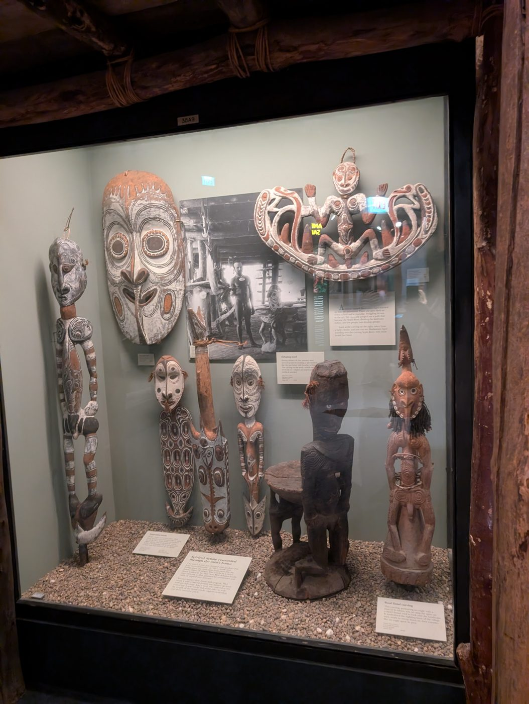
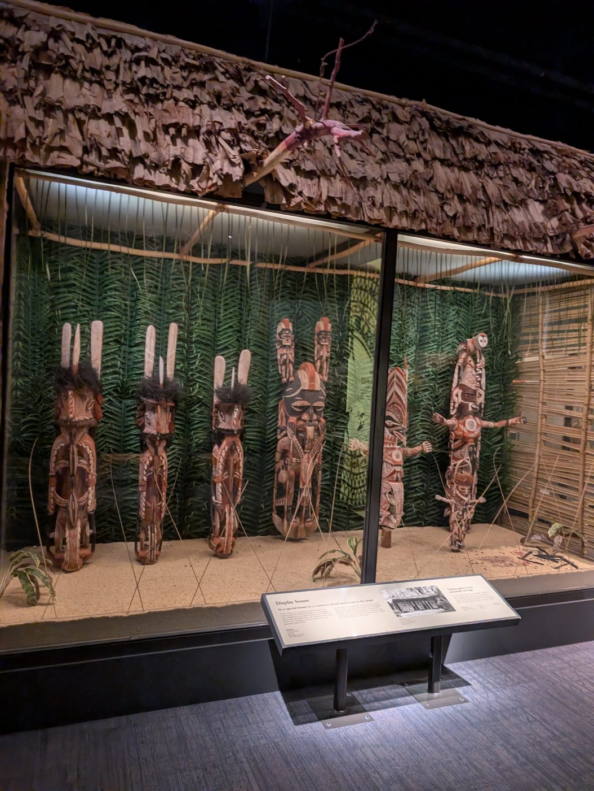
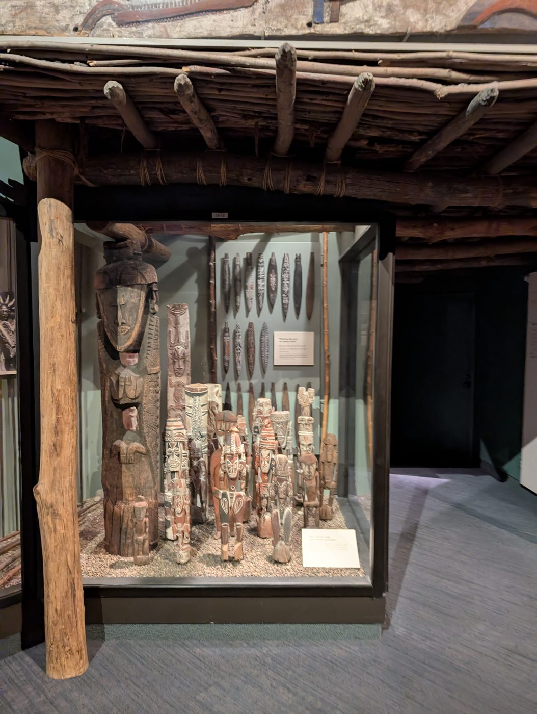
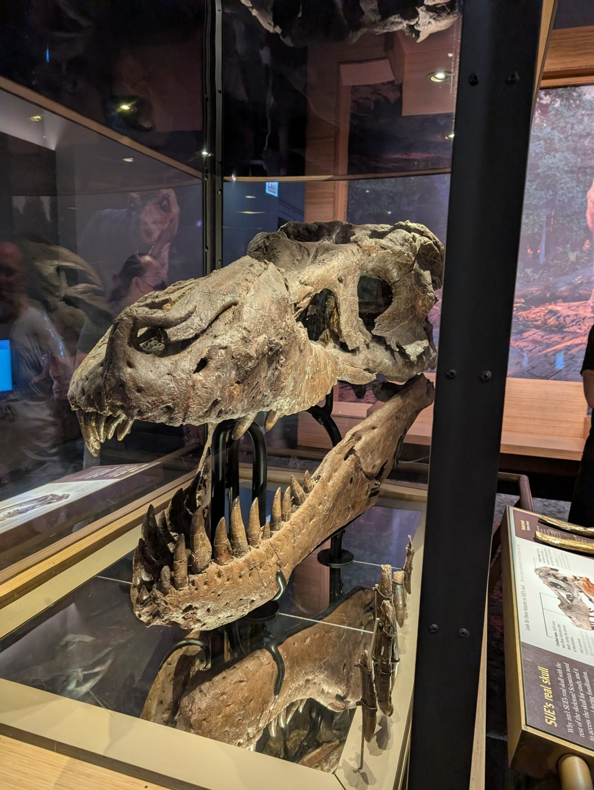
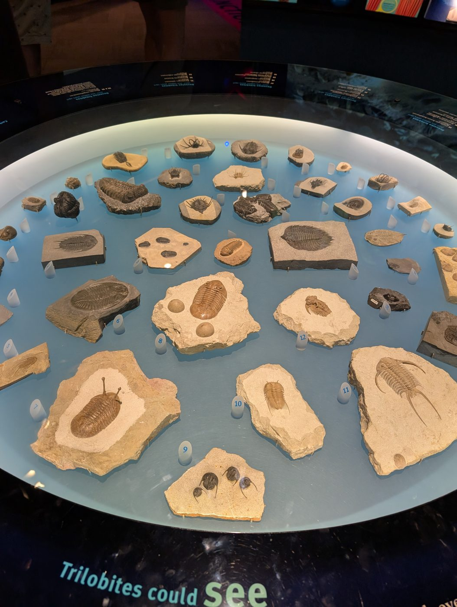
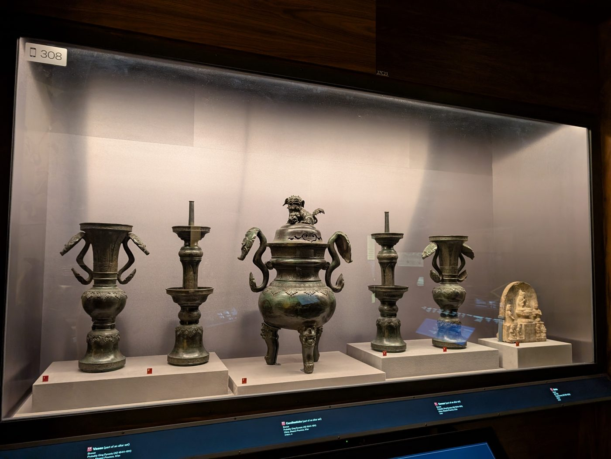
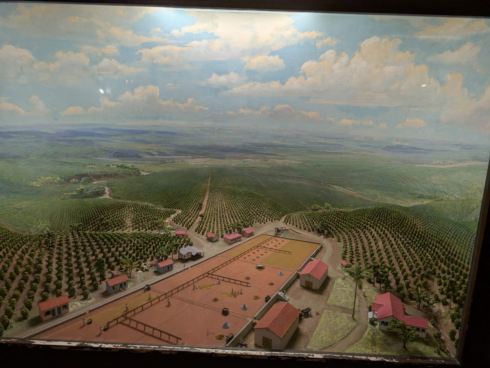
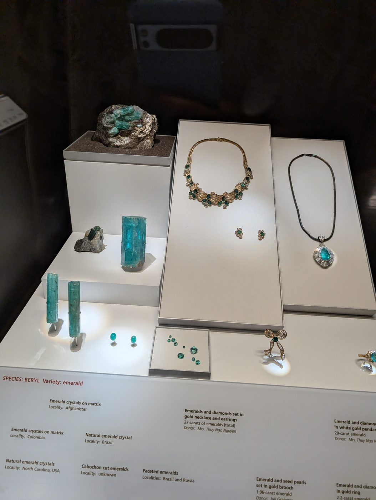

# Reference photographs, and the puzzle each one seeds

Eight photographs the owner took in a natural history museum on 4 September 2026,
downscaled to 1400 px and stripped of their metadata (the originals carried GPS
coordinates, which do not belong in a repository). They are DESIGN REFERENCES: what a
case looks like, how it is lit, what a label says, how glass sits between the visitor
and the thing. Nothing in them is reproduced in the game. Everything the game shows is
an original reinterpretation, and the premise (an alien recreation that is almost
right) is the reason it may be wrong. See `docs/ARCHITECTURE.md` question 11.

Each photo is read twice below: what is THERE, which is what the environment artist
needs, and what it SUGGESTS, which is a puzzle seed in the ADR-5 kinds. Seeds are
seeds; every one still needs an interactive prototype before it is built.

## 01. The men's house carvings

**There.** A tall case in a reconstructed men's house: a wall of carved and painted
figures and masks in ochre, white and black, a large oval mask with concentric eyes, a
splayed hook figure with a face at the top, a stool with a carved figure standing
behind it, a roof finial of a bird carrying a human face, suspension hooks. A
photograph inside the case shows the original house. Labels: one long panel, several
small cards. Gravel floor. Timber posts and a thatched lintel frame the case; the light
is warm, low, and from above.

**Suggests.** *Sequence.* The stool is a debating stool: a speaker strikes it with a
bundle of leaves to make a point. The figures on the wall are the speakers, each with a
number of strikes, and the order they spoke in is written into the room somewhere the
player has to look for (the photograph inside the case is the obvious place). Strike
the stool in that order and the finial bird turns its head. *Alignment* as a second
layer: the big mask's eyes are dials.

## 02. The display house of memorials

**There.** A long low case under a leaf thatch roof, back wall of palm fronds, sand
floor with dead leaves, six or seven tall memorial figures with paired paddle shaped
crests, feather ruffs, and painted bodies, plus one broad face mask. A reading rail in
front with a black and white photograph of the original house. Lit from the case
ceiling, soft and even; the frond wall is the brightest thing in the room.

**Suggests.** *Observation* on the observed / unobserved rule. The figures stand in an
order; the photograph on the rail shows the order they stood in originally. When the
player looks away one of them has moved, and the puzzle is to notice which and put it
back, while the rule keeps moving them. The room where the game teaches that the
museum changes behind you.

## 03. The ancestor post and the whirling slats

**There.** A freestanding tall case beside a log post: a massive dark ancestor post
carved with stacked faces, a slimmer painted post, a crowd of smaller painted figures
on gravel, and on the back wall two rows of leaf shaped flat slats with incised
patterns and one label headed "Whirling slats give the spirits voices". Long thin poles
lean in the case. Roof of lashed poles overhead.

**Suggests.** *Resonance.* The slats are bullroarers: swung on a cord they make a tone
that rises with speed. Each has a pattern and each pattern is a pitch. The figures on
the floor each face one slat. Spin the slats to the pitches the room asks for and the
ancestor post's faces open their eyes one by one. The sound design puzzle, and the one
that needs question 9 answered.

## 04. The tyrannosaur skull

**There.** The real skull of a very large tyrannosaur, on a black steel cradle inside
a tall glass case, lit from above. Its jaw is separate below it; several teeth stand
loose in a rack at the front. A label panel outside says the real skull is not on the
skeleton because it is too heavy for the mount, and gives a "look for these features"
list. Warm timber panelling, an illuminated backdrop of a forest.

**Suggests.** *Arrangement* and *Illumination.* The loose teeth go back into the jaw,
and only the right tooth fits each socket (the label's feature list is the key). With
the jaw complete, the light through the case falls through an eye socket onto the
backdrop and shows something the forest picture did not have before. The museum's
"heavy" label is the aliens' misunderstanding: in their copy the skull is what holds the
building up.

## 05. The trilobite table

**There.** A round table under glass, backlit blue, forty or so trilobite fossils on
their matrix slabs, twelve of them numbered on small frosted tags, a ring of labels on
the black rim, and the heading "Trilobites could see". Specimens range from thumbnail
to hand sized; several have long spines, one has stalked eyes.

**Suggests.** *Combination.* Twelve numbered specimens, and the rim of the table is
the dial. "Trilobites could see" is the clue: only some of the twelve have eyes, and
the ones that do are the combination, in the order the numbers give. The table
rotates in inspect mode; reading it right lights the specimens that could see, and
they all turn to look at the same point on the ceiling.

## 06. The bronze altar set

**There.** A wide wall case on grey paper, five bronzes on white plinths numbered
1 to 5 in red: two flared vases with animal head handles, two pricket candlesticks,
and a lidded tripod censer with a lion on the lid, plus a small carved stone stele of
a seated figure to the right. Labels along the bottom edge name them as an altar set.
Lit evenly and slightly cool; a phone icon and a number in the top corner for the
audio guide.

**Suggests.** *Arrangement.* The set is in the wrong order (the aliens numbered it,
they did not understand it). Censer in the centre, candlesticks flanking, vases
outboard: the correct altar order. Then a *Sequence*: light the candles, and the
censer's lid lifts to show the lion is hollow and holds the next thing. The stele is a
hint, carved with the set in its proper arrangement.

## 07. The plantation diorama

**There.** A large scale model behind glass: a drying yard with tiny workers raking
coffee, red roofed buildings, a wall, palms, and rows of shrubs running to a painted
horizon of hills under a cloudy sky. The painted backdrop is lit as daylight; the case
frame is old, chipped white paint.

**Suggests.** *Observation* and a scale trick. In inspect mode the diorama is a room:
the camera goes down into it and the yard is full size, the sky is the painting, and
the workers are the museum's only "people", which the liminal aesthetic has been
withholding. What they are raking is the pattern for a lock elsewhere, and it can only
be read from inside. The diorama is also the one place ADR-7's scatter exception is
expected to be used, for the shrubs.

## 08. The emerald case

**There.** A gem case on white stepped plinths in a dark alcove: emerald crystals on
matrix, a large single crystal, cut stones loose on a tray, a necklace and earrings,
a pendant on a cord, a bow brooch and a ring. Labels on the plinth name species,
variety, locality and carat weight. Each object has its own small spot; the glass
reflects the hall.

**Suggests.** *Illumination* and *Combination*. The torch through the large crystal
projects a green pattern on the alcove wall, and the pattern is a map of the hall the
player has not found. The carat weights on the labels are the numbers of the lock
that opens it. Four localities on four labels are four directions. The gem hall is the
game's darkest space and the one where the volumetric light does the most work.
